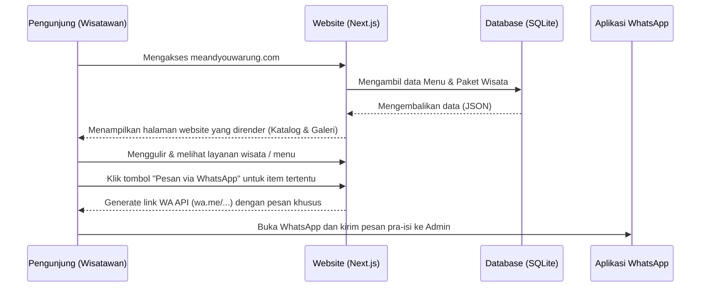
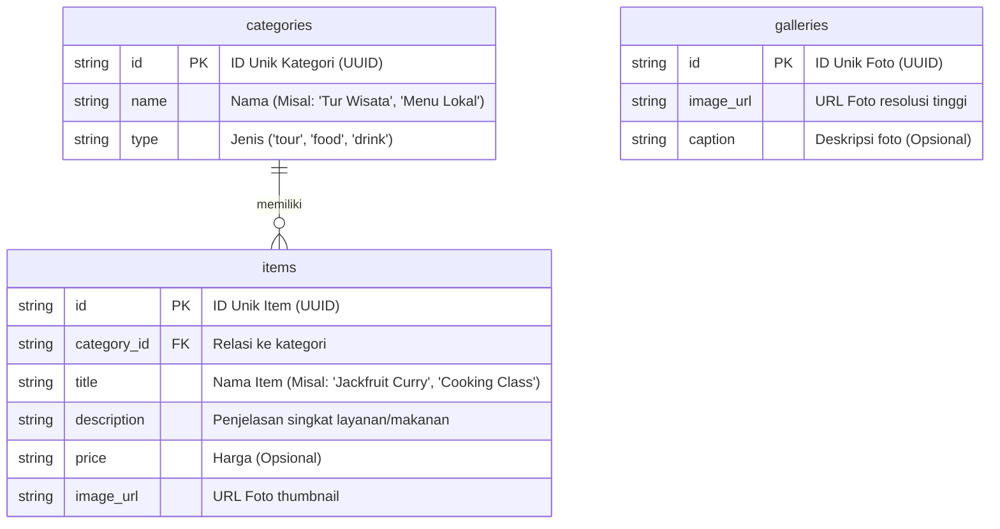

# PRD — Project Requirements Document

## 1. Overview
**Me & You Warung** adalah sebuah website berjenis *landing page* yang dirancang khusus untuk mempromosikan layanan dan pengalaman lokal di Tetebatu kepada wisatawan lokal maupun mancanegara. 

Saat ini, wisatawan membutuhkan satu tempat informatif untuk mengetahui apa saja yang ditawarkan oleh Me & You Warung. Website ini hadir untuk memecahkan masalah tersebut dengan menyajikan katalog lengkap paket wisata (seperti *Tetebatu panorama walking*, *cooking class*, dan penyewaan skuter) serta menu kuliner yang memadukan cita rasa lokal dan internasional. Dengan desain yang natural, sederhana, modern, dan ramah wisatawan, tujuan utama aplikasi ini adalah memudahkan pengunjung untuk mencari informasi, melihat dokumentasi foto, menemukan lokasi, dan pada akhirnya **langsung melakukan reservasi melalui WhatsApp**.

## 2. Requirements
- **Mobile-First & Responsif:** Website harus tampil sempurna dan mudah digunakan di layar *smartphone*, mengingat mayoritas wisatawan mengakses informasi melalui HP saat sedang bepergian.
- **Performa Cepat:** Waktu muat halaman (*loading time*) harus cepat agar wisatawan tidak meninggalkan website.
- **Desain Natural & Modern:** Estetika antarmuka UI/UX harus mencerminkan nuansa alam Tetebatu yang asri, dipadukan dengan tata letak yang bersih dan rapi.
- **Integrasi Pihak Ketiga:** Membutuhkan integrasi tautan langsung ke WhatsApp API untuk pesanan dan Google Maps untuk penunjuk arah.
- **Konten Mudah Dibaca:** Menggunakan struktur navigasi tunggal (*one-page scroll* atau beberapa halaman simpel) yang memandu pengunjung dari pengenalan tempat hingga tombol pemesanan.

## 3. Core Features
- **Daftar Paket Wisata:** Menampilkan kartu/katalog layanan wisata seperti *Tour Tourism*, *Cooking Class*, *Coconut Oil/Coffee Process*, *Massage/Spa*, *Transport*, dan Rental Kendaraan.
- **Daftar Menu Menu Lengkap:** Menampilkan menu makanan (Lalapan, *Jackfruit Curry*, *Spring Roll*, Pizza, dll) dan minuman (*Fresh Coconut*, Kopi Lombok, dll) dengan rapi dan menarik.
- **Tombol Chat WhatsApp (Reservasi Langsung):** Tombol aksi utama (*Call-to-Action*) yang melayang di layar (*floating button*) atau disematkan di tiap menu/paket wisata agar pengunjung bisa langsung chat dengan admin. Pesan WA akan terisi otomatis sesuai layanan yang dipilih.
- **Galeri Foto Kegiatan:** Sekumpulan foto atau *carousel* yang menampilkan keindahan panorama, keseruan tur, dan suasana warung untuk membangun kepercayaan pengunjung.
- **Peta Lokasi Terintegrasi:** Menampilkan peta interaktif (Google Maps) lengkap dengan alamat dan jam operasional Me & You Warung.

## 4. User Flow
1. **Beranda (Landing Page):** Pengunjung membuka website dan disambut oleh foto pahlawan (*hero image*) panorama Tetebatu / Warung beserta kalimat sambutan yang menarik.
2. **Eksplorasi Konten:** Pengunjung menggulir layar ke bawah untuk melihat "Paket Wisata Terpopuler" dan "Menu Andalan Warung".
3. **Mempelajari Detail:** Pengunjung mengeklik gambar di "Galeri" untuk melihat aktivitas secara lebih detail dan mengecek bagian "Lokasi" untuk melihat seberapa jauh tempat tersebut.
4. **Keputusan Pemesanan (First Win):** Pengunjung tertarik dengan *Cooking Class* (atau menu makanan), lalu mengeklik tombol "Pesan via WhatsApp".
5. **Pengalihan ke WhatsApp:** Pengunjung diarahkan ke aplikasi WhatsApp secara otomatis dengan pesan yang sudah tertulis (misal: *"Halo, saya ingin reservasi untuk Cooking Class..."*). Proses selesai di sini.

## 5. Architecture
Walaupun berbentuk *landing page*, website ini dibangun secara dinamis agar pemilik warung dapat mengubah menu dan paket wisata di kemudian hari tanpa harus mengubah kode.

## 6. Database Schema
Kumpulan tabel sederhana ini dirancang jika di masa depan Me & You Warung ingin mengubah atau memperbarui informasi sendiri (menggunakan *Content Management System* minimalis).

*   **Tabel `categories`**: Disewa untuk membedakan antara "Makanan", "Minuman", "Layanan Tur", dll.
*   **Tabel `items`**: Menyimpan detail dari setiap produk masakan atau paket liburan.
*   **Tabel `galleries`**: Menyimpan tautan / URL gambar untuk galeri kegiatan.

## 7. Tech Stack
Untuk mencapai website yang berkinerja tinggi, modern, cepat, serta infrastruktur data yang ringan (berdasarkan prioritas standar terbaik saat ini), berikut adalah rekomendasinya:

- **Frontend:** **Next.js** (App Router) — Sangat optimal untuk SEO dan performa responsif, cocok agar website mudah ditemukan di Google oleh turis.
- **Styling & UI:** **Tailwind CSS** dipadukan dengan **shadcn/ui** — Memungkinkan pembuatan antarmuka yang bersih, estetik, dan berfokus pada nuansa *natural & modern* secara cepat.
- **Database:** **SQLite** — Database relasional yang sangat ringan. Sangat lebih dari cukup untuk website skala warung baca/tulis data menu yang tidak terlalu masif.
- **ORM (Object Relational Mapper):** **Drizzle ORM** — Digunakan sebagai perantara komunikasi antara aplikasi Node.js dan SQLite secara aman.
- **Deployment:** **Vercel** — Untuk *hosting* gratis atau berbayar murah yang terintegrasi langsung dengan ekosistem Next.js, menjamin website selalu *online* tanpa *downtime*.